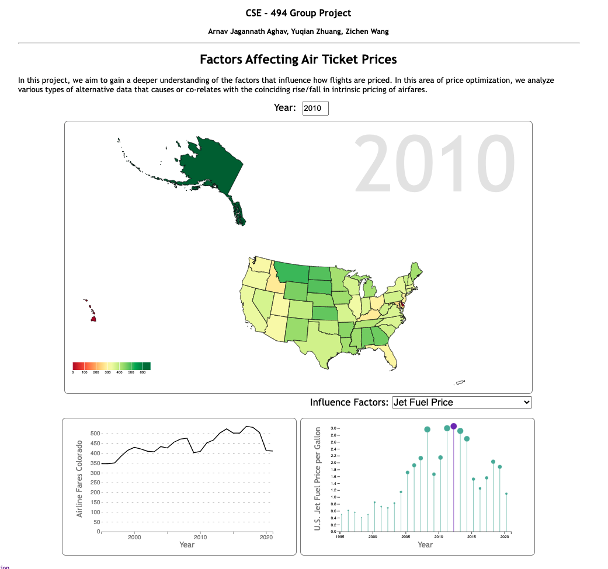
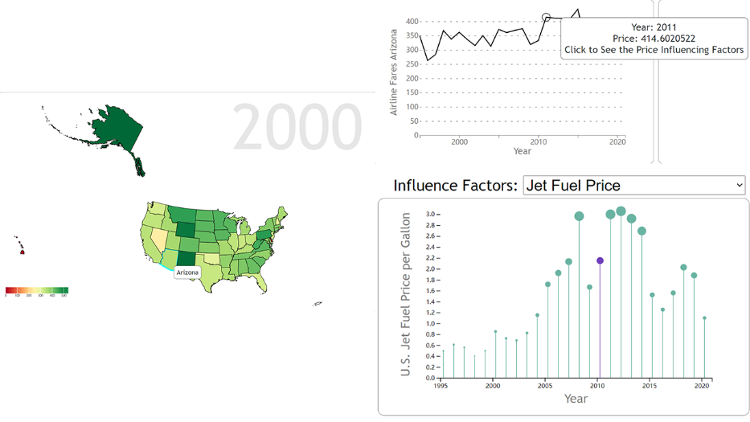

# Factors Affecting Air Ticket Prices

## Overview
In this project, we aim to gain a deeper understanding of the factors that influence how flights are priced. In this area of price optimization, we analyze various types of alternative data that cause or co-relate with the coinciding rise/fall in intrinsic pricing of airfares.
 

---
## Contents

 - [Data description](#Data-description)
 - [Goals and Tasks](#Goals-and-Tasks)
 - [Idioms](#Idioms)
 - [Reflection](#Reflection)
 - [Team Workload](#Team-Workload)

## Data description
 

**Data Sources**  
- [Air Fare by State](https://www.transtats.bts.gov/AverageFare/)
- [Aviation Kerosene Price](https://www.eia.gov/dnav/pet/hist/LeafHandler.ashx?n=PET&s=EER_EPJK_PF4_RGC_DPG&f=M)  
- [NASDAQ Composite Index](https://fred.stlouisfed.org/series/NASDAQCOM#0)

**Data Processing**
- We converted the Air Fare By State data from xsl to csv format.
- We only left the Aviation Kerosene Price and Year Properties.
- We only left the Year and Annual % Change properties for NASDAQ Index.
---
## Goals and Tasks
- Our target user group is the gourp of people who want to know the factors might affect the air ticket prices. In our visulizations, uses will be able to see the air ticket prices per year in each state, and they also can see the influence factors such as Jet Fuel Price with corresponding year. Finally, by looking at our visualizations, the uses will be able to have a general understanding of ticket prices and factors that may be associated with them.
---
## Idioms
- Interface: We have three visualizations in our web page  
  1. Air ticket price by price with U.S. map. An input control to change the year of ticket price.
  2. Line chart of State ticket price by year.
  3. Innovation chart of Influence factors. A select control to change the influence factor to present.
- Implementation: Users will be able to click the state in the U.S. map to see the ticket price chart of that state. Users will be able to click the specific in line chart of ticket price to see the influence factors chart with the hightlight clicked year.
- Encoding:  
    1. Map Visualization:
        - Items: States Map
        - States Color: Ticket Price Value  
    2. Line Chart:
        - Items: Line
        - X-axis: Year
        - Y-axis: Ticket Price
    3. Innovation Chart:
        - Items: Line and Circle
        - Circle Area: value of Influence Factor
        - X-axis: Year
        - Y-axis: Influence Factor Value  

- Interactions: By changing the input, you can see the price change in map. By changing the select, you can switch between Fuel Price and NASDAQ Index.
- Views Linked: By clicking the state in the U.S. map visulization, the ticket price line chart will appear. By clicking the line chart, the influence factors chart will appear and highlight the year which the user has clicked in the line chart.
- Algorithms: We didn't use any algorithm specifically. We just simply present the data.
---
## Reflection
- We initially spent a lot of time deciding on our theme, and in the end we chose the current theme. After We decided the topic and finished the proposal, we started to collected the dataset. For the WIP, we didn't make that much of progress, but we have finished all the basic frameworks such ass the css layout, svg layout, and some writeups in html. Finally, by following our proposal, we have finished almost all the functions, and then we meet again to make sure that our project have met all the requirements.
- Our goal is clear, and we never change our goal.
- Compare to our proposal, we didn't change too much, but we have removed some datasets which we think is necessary to make our dashboard more clear.
- Because of the end of the semester, everyone is very busy, and we cannot meet and work together very oftenly, for example, sometimes there are some problems or questions posted in the group, but people cannot respond it or solve it immediately, but we finally finished the project according to our plan.
- For next time, I would start the project earlier with my team so that we have more time to work together and have better communication.
---
## Team Workload
- We have finished the most of the functions together. Yuqian has fixed some bugs related to the tooltip, and he also did the most of the css layout. Zichen put a lot effort on the map visualizations and line chart with Aranv. Aranv put a lot time on design proposal and finishing the documentations.

